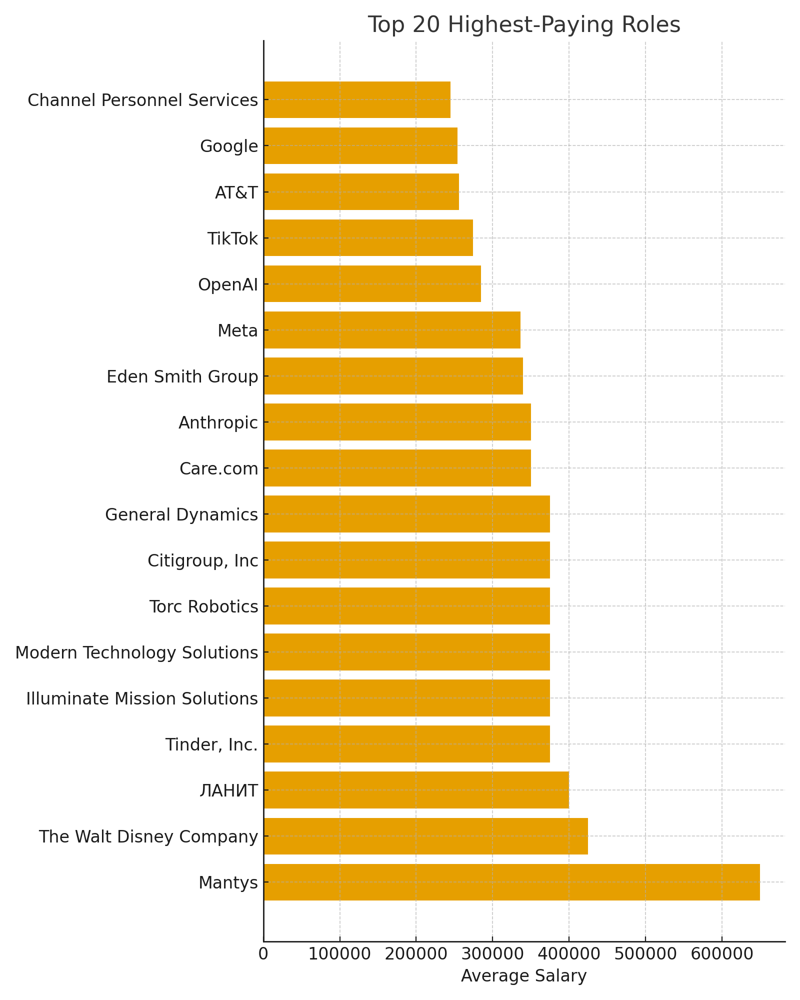
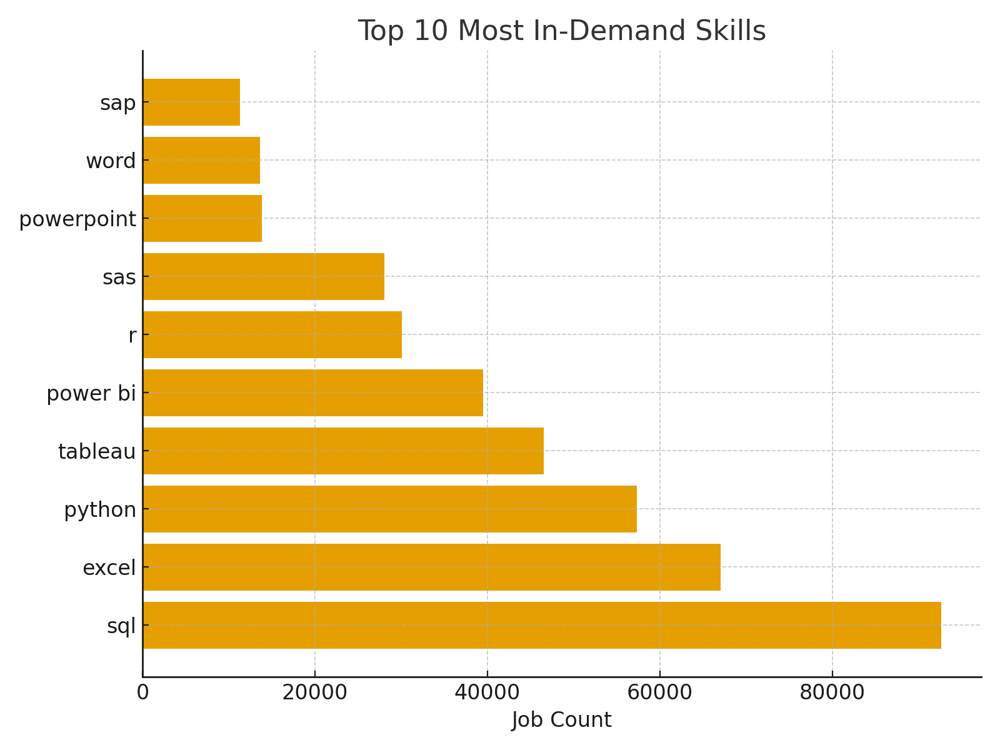
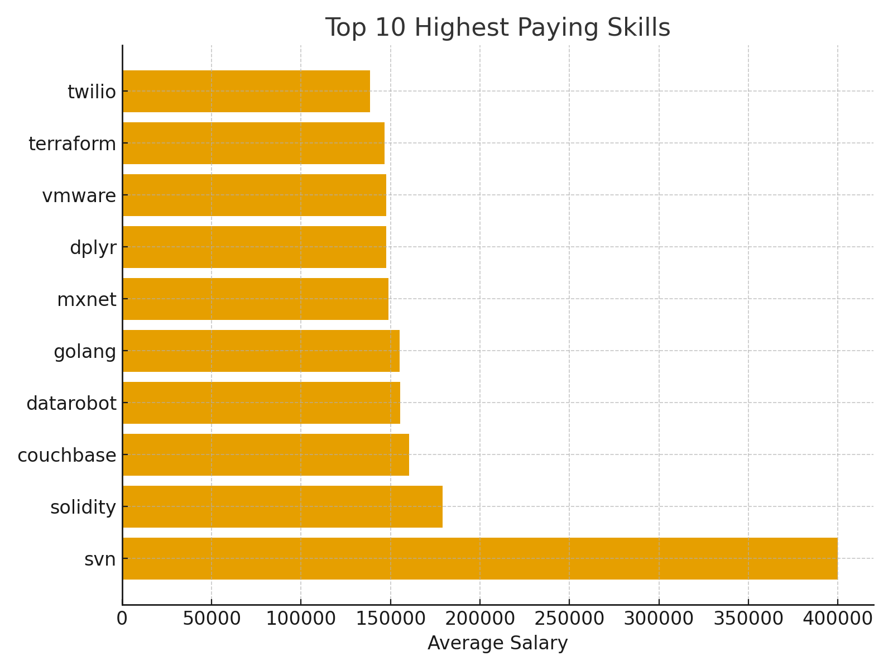
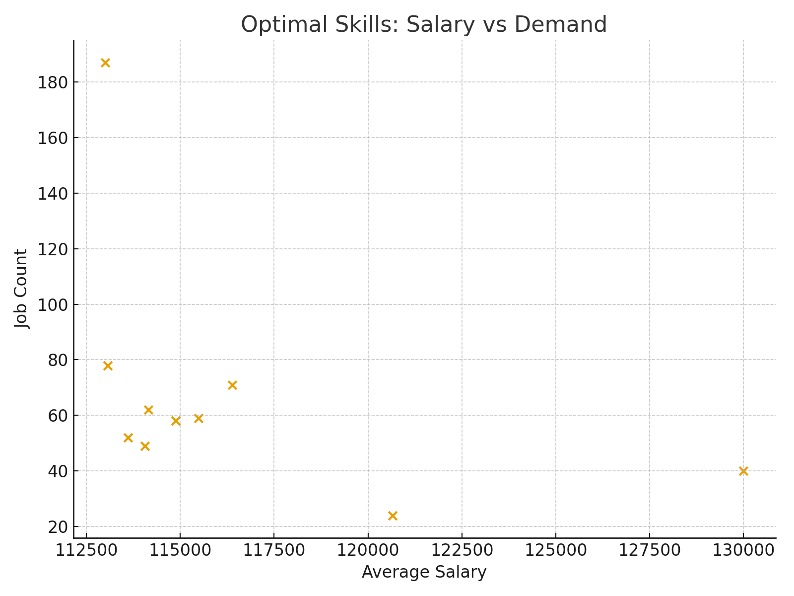

# Introduction

This project contains a complete SQL workflow for analyzing the job market for **Data Analyst positions**, including identifying the highest-paying roles, determining in-demand skills, and discovering the most optimal (high-demand + high-paying) skills.

It includes:

- A PostgreSQL database creation and loading pipeline [sql loading pipeline](/sql_load/)
- Analytical SQL queries organized by business questions [sql project queries](/queries/)

---

# Background

The purpose of this project is to analyze a dataset of job postings related to Data Analyst positions.  
The dataset includes:

- Job titles, company information, locations, salaries, remote status
- A skills dimension
- A relationship table mapping each job to its required skills

To explore this data, I built:

- A relational database using dimensional modeling
- SQL queries to extract insights about salaries, demand, and optimal skill combinations

This project simulates a real analytics workflow:  
from **raw CSV files** → **database design** → **data loading** → **business-focused SQL analysis**.

---

# Tools I Used

- **PostgreSQL** — main database engine
- **SQL** — joins, CTEs, aggregates, window functions
- **COPY command** — efficient CSV ingestion
- **Dimensional modeling** (fact + dimensions + bridge table)
- **VSCode** — SQL development environment

---

# The Analysis

This project was aimed to investigate specific aspects of the data analyst job market and it answered the following questions:

1. **What are the top 20 highest-paying Data Analyst jobs based on the dataset?**  
   Identifies the highest-paying roles, including job title, company name, and annual salary.

   ```sql
   SELECT
       jpf.job_title AS job_role,
       cd.name AS company_name,
       jpf.salary_year_avg AS average_salary,
       RANK() OVER (ORDER BY salary_year_avg DESC) AS rank_position
   FROM
       job_postings_fact AS jpf
   LEFT JOIN company_dim AS cd ON cd.company_id = jpf.company_id
   WHERE
       (jpf.job_title_short LIKE '%Data Analyst%')
       AND
       (jpf.salary_year_avg IS NOT NULL)
   LIMIT 20;

   ```

2. **What skills are required for each of these top 20 highest-paying jobs?**  
   Retrieves all skills associated with the highest-paying remote Data Analyst roles.

   ```sql
   WITH top_20_paying_jobs AS(
   SELECT
       jpf.job_id,
       jpf.job_title AS job_role,
       cd.name AS company_name,
       jpf.salary_year_avg AS average_salary,
       RANK() OVER (
           ORDER BY salary_year_avg DESC
       ) AS rank_position
   FROM job_postings_fact AS jpf
       LEFT JOIN company_dim AS cd ON cd.company_id = jpf.company_id
   WHERE (
           jpf.job_title_short LIKE '%Data Analyst%'
       )
       AND (jpf.salary_year_avg IS NOT NULL)
   LIMIT 20
   )

   SELECT
       sd.skills AS skill_name,
       tpj.company_name,
       tpj.average_salary
   FROM top_20_paying_jobs AS tpj
   JOIN
       skills_job_dim AS sjd ON tpj.job_id = sjd.job_id
   JOIN
       skills_dim AS sd ON sjd.skill_id = sd.skill_id
   ORDER BY tpj.rank_position ASC;
   ```

3. **What are the most in-demand skills for Data Analysts across the job market?**  
    Counts the frequency of each skill across all Data Analyst job postings.

    ```sql
   SELECT
    sd.skills AS skill_name,
    COUNT(jpf.job_id) AS job_count
   FROM 
    skills_dim AS sd
   JOIN skills_job_dim AS sjd ON sd.skill_id = sjd.skill_id
   JOIN job_postings_fact AS jpf ON sjd.job_id = jpf.job_id
   WHERE 
    jpf.job_title_short = 'Data Analyst'
   GROUP BY 
    sd.skills
   ORDER BY 
    job_count DESC
   LIMIT 10;
   ```

4. **What are the most high paying skills for Data Analysts across the job market?**  
   Calculates the average year salary offered for each skill across all Data Analyst job postings.
   ```sql
   SELECT 
        sd.skills AS skill_name,
        ROUND(AVG(jpf.salary_year_avg), 1) AS average_salary
    FROM job_postings_fact AS jpf
    JOIN skills_job_dim AS sjd ON jpf.job_id = sjd.job_id
    JOIN skills_dim AS sd ON sjd.skill_id = sd.skill_id
    WHERE 
        jpf.salary_year_avg IS NOT NULL
        AND jpf.job_title_short = 'Data Analyst'
    GROUP BY 
        sd.skills
    ORDER BY 
        average_salary DESC
    LIMIT 10;
   ```

5. **Which skills are the most optimal—those that combine high demand with high salaries?**  
   Evaluates skills that appear frequently while also being tied to above-average salaries.

   ```sql
    SELECT 
        sd.skills,
        COUNT(jpf.job_id) AS job_count,
        ROUND (AVG(jpf.salary_year_avg), 1) AS average_salary
    FROM 
        job_postings_fact jpf
    JOIN skills_job_dim sjd ON jpf.job_id = sjd.job_id
    JOIN skills_dim sd ON sjd.skill_id = sd.skill_id
    WHERE
        (jpf.job_title_short = 'Data Analyst') AND (jpf.salary_year_avg IS NOT NULL)
    GROUP BY 
        sd.skills
    HAVING 
        COUNT(jpf.job_id) > 20
    ORDER BY
        average_salary DESC,
        job_count DESC
    LIMIT 10;
   ```
---
# What I Learned

## Top 20 Highest-Paying Data Analyst Roles


## Skills Required in Top 20 Highest-Paying Jobs


## Most In-Demand Skills


## Highest-Paying Skills


## Optimal Skills — Salary vs Demand
 

# Conclusions
The analysis of the Data Analyst job market reveals several key insights based on the results of the five SQL queries executed in this project.

## 1. The highest-paying Data Analyst roles are not traditional analyst positions  
The top 20 highest-paying jobs include titles such as Senior Director of Data, Research Scientist, Director of Analytics, and Head of Data Analytics. These roles command high salaries because they require a combination of leadership responsibilities and advanced technical expertise. Companies such as OpenAI, Meta, AT&T, Google, Tinder, and Disney dominate the list of top-paying employers.

## 2. The skills required for the top-paying roles are highly specialized  
The skills extracted for these top 20 roles show a clear emphasis on advanced, engineering-oriented tools and technologies. Skills such as Oracle, Kafka, Linux, Git, Spark, Airflow, Snowflake, and BigQuery frequently appear among the highest-paying positions. While foundational skills like SQL, Python, R, and Excel remain present, the best-paying roles lean heavily toward infrastructure, cloud, and advanced analytical engineering.

## 3. The overall job market demands foundational analytics skills at massive scale  
When examining the most in-demand skills across the entire Data Analyst job market, SQL, Excel, Python, Tableau, and Power BI dominate by a large margin. SQL alone appears in over 92,000 job postings. This indicates that foundational analytical skills remain the most critical requirement for employability and are essential for entering the field or securing mid-level roles.

## 4. The highest-paying individual skills are niche and appear infrequently  
Skills such as SVN, Solidity, Couchbase, DataRobot, Golang, MXNet, VMware, and Terraform show extremely high average salaries. However, they appear in a very small number of job postings. These skills tend to belong more to software engineering, DevOps, or advanced machine learning engineering roles. Their high compensation reflects specialization rather than broad demand.

## 5. Optimal skills show a balance of strong salary and moderate demand, but remain far less common than foundational skills  
The skills identified as most optimal (those with both high demand and above-average salary) include Spark, GCP, Airflow, Linux, Scala, MongoDB, TensorFlow, and Pyspark. These skills achieve strong salaries and appear consistently across postings, but still in relatively low numbers. Even the most frequently appearing optimal skill, Spark, shows fewer than 200 postings, compared to SQL with more than 92,000. This indicates that optimal skills are valuable differentiators but do not replace the importance of core analytical tools.

## Summary

Overall, the results suggest that Data Analysts who combine strong foundational skills (SQL, Excel, Python, Tableau/Power BI) with specialized engineering-oriented skills (Spark, Airflow, GCP, cloud systems, and distributed computing technologies) are best positioned to maximize both job opportunities and salary potential. The foundational skills ensure broad employability, while the specialized skills open doors to higher-paying roles and more advanced analytical engineering positions.